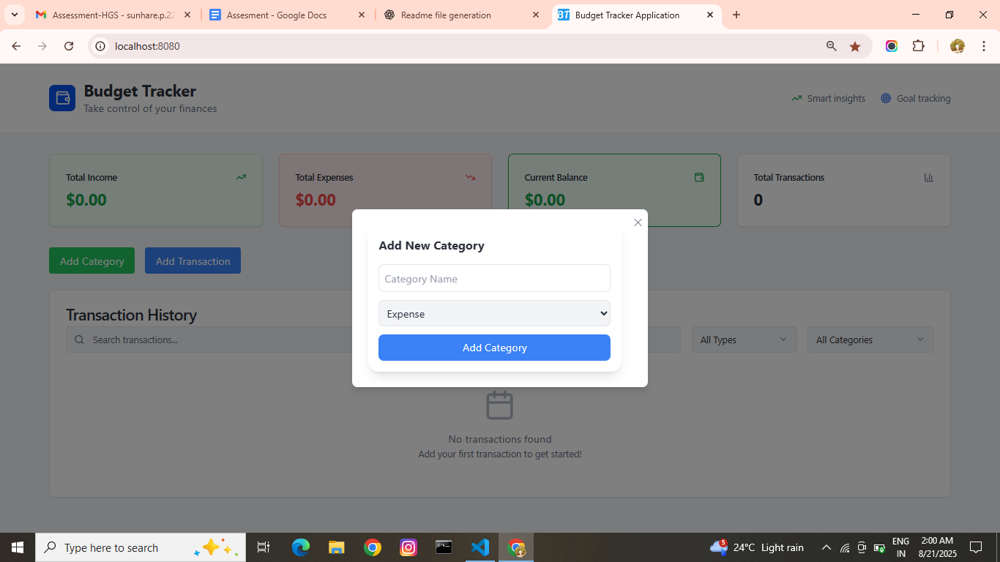
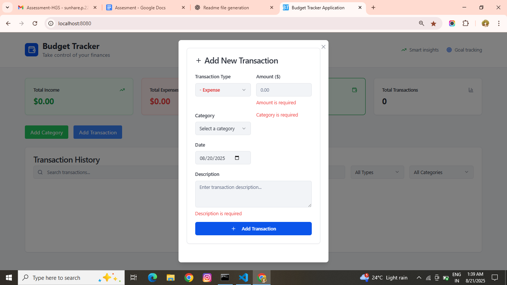
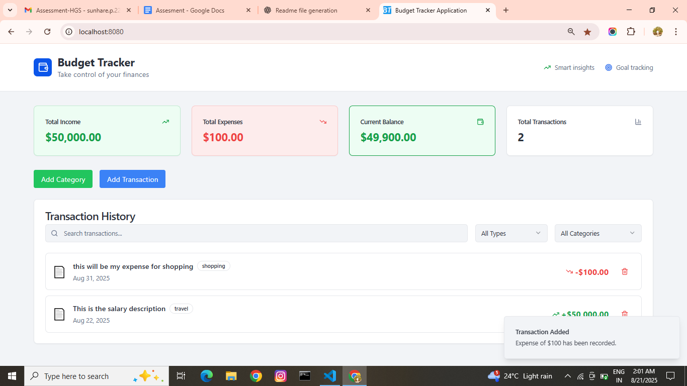

#  Budget Tracker Web Application

A **user-friendly and responsive** budget tracking application built with **React.js** and **TypeScript**.  
This app empowers users to efficiently manage their finances with a clean UI, real-time updates, and comprehensive insights into spending habits.

---

## 🚀 Project Objective

The goal of this application is to enable users to:
- **Add Income and Expenses**  
  Record transactions easily, with icons representing categories, colored amounts (+/-), description, and date.
- **View Running Balance**  
  Instantly see your current balance at a glance.
- **Categorize Spending**  
  Create **custom categories** like Rent, Groceries, Salary, etc.
- **Generate Budget Summary**  
  Get totals for income, expenses, and calculated balance.
- **Explore Transaction History**  
  Review past transactions to analyze spending patterns and make informed decisions.
- **Store Data Safely**  
  Persist data using **IndexedDB** or an optional **backend API**.

---

## 📌 Use Cases

- **Add New Transaction**  
  Select income or expense, enter details (amount, category, date), and save instantly.  

- **Create Custom Categories**  
  Personalize your spending groups to fit your lifestyle.  

- **Transaction History**  
  Access and filter previous records to understand where your money goes.  


## 🛠️ Tech Stack

- **Frontend**: React.js (with TypeScript)  
- **Styling**: Tailwind CSS / Custom CSS Modules
- **Local State Management** : React Hooks  
- **Data Storage**: IndexedDB  

---

## 📂 Project Structure

src/
├── components/
│ ├── budget/
│ │ ├── BudgetSummary.tsx
│ │ ├── TransactionForm.tsx
│ │ └── TransactionList.tsx
| | └── CategoryForm.tsx
│ └── common/
│
├── hooks/
  └── useBudget.ts
│
├── pages/
├── types/
├── App.tsx
├── main.tsx
└── index.css


---

## 🧩 Features in Action

- **Add & Delete Transactions**  
- **Running balance auto-calculated**  
- **Category-based filtering**  
- **Responsive design for all devices**  
- **Persist transactions locally with IndexedDB**  

---

## 📸 Screenshot









## 📦 Installation & Setup

1. Clone the repository:
   ```bash
   git clone https://github.com/psbugs/budget-tracker-application.git
   cd budget-tracker-application


Below commands being used to install, start server and build for production.

Install dependencies:
npm install

Run the development server:
npm run dev

Build for production:
npm run build